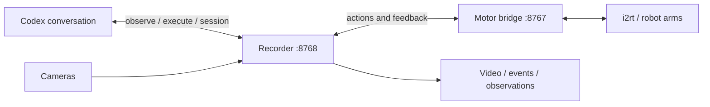

# Run an agentic task

The agent is the current Codex conversation on the robot computer. It sees images,
chooses numerical actions, calls the robot tools, and inspects what actually happened.
There is no Python `Agent()` object or separate model service to launch. The bridge
and recorder contain hardware and recording code; Codex supplies the task decisions.



## Prepare the robot computer

Complete the [README hardware setup](../README.md): install dependencies, identify
the adapters and cameras, configure CAN, and calibrate the grippers. Save the six
hardware environment values (`ROBOT_ID`, `LEFT_CAN`, `RIGHT_CAN`, `LEFT_CAMERA`,
`RIGHT_CAMERA`, `TOP_CAMERA`) in the repository's ignored `.env` file using shell
assignments. Calibration belongs in `calibration/<ROBOT_ID>.json` and stays local.
Run the commands below from the repository root on that same computer.

Install or update dependencies **before starting hardware control** with
`uv sync --locked`. The run commands use `.venv/bin` directly so a task does not
change the environment of a controller that is already holding the arms.

For an existing installation, inspect the current bridge first:

```bash
mkdir -p outputs
printf '{"operation":"status"}\n' > outputs/session-status.json
.venv/bin/robot-call session --url http://127.0.0.1:8767/mcp \
  --arguments outputs/session-status.json
```

Reuse connected, healthy sessions. If the connection fails, check the existing
controller's status before starting another process. Do not restart or kill a
bridge holding enabled arms. Updates can be installed after a supported release;
changing files does not update the code already loaded into a running controller.

## Start persistent processes

For a **new controller only**, this Ubuntu user service keeps it independent of the
agent's terminal. It starts disconnected and does not enable motors:

```bash
systemd-run --user --unit=agentic-robot-bridge \
  --property="WorkingDirectory=$PWD" \
  /bin/bash -c '
set -e
set -a
source .env
set +a
exec .venv/bin/robot-bridge --port 8767
'
```

The user must establish physical support before a new arm session is started.
`session` with `{"operation":"start","arm":"left","supported":true}` enables
the left arm; use `right` for the other arm. Only set `supported` when it is true.
The optional `reset_communication: true` permits one startup communication-timeout
reset when the user has authorized it. Motor protection faults are never cleared
automatically. Active sessions need no new start call.

For a recorded task, start the recorder separately. Stop other camera viewers
beforehand. Choose a **new output directory for every attempt**; do not create the
leaf directory yourself. This example uses the included task prompt:

```bash
systemd-run --user --collect --unit=agentic-robot-record \
  --property="WorkingDirectory=$PWD" \
  /bin/bash -c '
set -e
set -a
source .env
set +a
exec .venv/bin/python -m scripts.robot_record \
  --prompt-file docs/prompts/camera-target-practice.txt \
  --output outputs/rollouts/camera-practice-001 \
  --port 8768
'
```

Inspect startup with `journalctl --user -u agentic-robot-record -n 30 --no-pager`.
Wait until the `recording` tool's `status` reports `ready: true`; this recorder
requires all three streams to be available and fresh to accept recorded actions.
It owns the cameras, so all observations during the run go through port **8768**.
The original bridge remains responsible for motor control and powered hold.

## Give the task to Codex

Open this repository in a local Codex task on the robot computer. The project
[MCP configuration](../.codex/config.toml) defines `robot` on port 8767 and
`robot_recording` on port 8768. Reconnect MCP after starting the servers if necessary.
Both entries set a one-hour tool timeout for long actions. Codex supports project
MCP configuration in trusted projects; see the
[official MCP documentation](https://learn.chatgpt.com/docs/extend/mcp?surface=cli).

If the client does not load project configuration, register the recorder with:

```bash
codex mcp add robot_recording --url http://127.0.0.1:8768/mcp
```

Check registration with `codex mcp get robot_recording`. In the corresponding
entry in `~/.codex/config.toml`, use the same timeout as the project config:

```toml
[mcp_servers.robot_recording]
url = "http://127.0.0.1:8768/mcp"
tool_timeout_sec = 3600
```

**Paste the contents of [camera-target-practice.txt](prompts/camera-target-practice.txt)
into the Codex conversation**, and add:

> Recording is already running at http://127.0.0.1:8768/mcp and saving to
> outputs/rollouts/camera-practice-001. Start the task now.

Use the directory you actually launched. The recorder's `--prompt-file` saves a
copy in the rollout metadata; it does **not** send the prompt to a model or start
the task. The conversation message initiates the agent's work. For a new task,
save its text in another prompt file and give that same text to Codex.

The agent inspects status, displays camera images, and chooses its actions. It
reports brief action intents and observed results in the conversation. Task
assessment and feedback corrections do not require a human decision at each step;
the client's configured permissions still apply to tool execution.

## Where the numbers and decisions go

Command-line options, types, defaults, and help text are declared in dataclasses
and parsed by [tyro](https://brentyi.github.io/tyro/). See `Args` and `CallArgs` in
[`scripts/robot_mcp.py`](../scripts/robot_mcp.py), and `Args` in
[`scripts/robot_record.py`](../scripts/robot_record.py). Run a command with `--help`
to inspect its options without starting hardware or recording.

Targets, frames, gripper openings, and durations are arguments to `execute`.
For example, this is the shape of a small joint-delta request:

```json
{
  "action": {
    "arm": "left",
    "kind": "joint_delta",
    "joints_rad": [0.03, 0, 0, 0, 0, 0],
    "duration_s": 5
  }
}
```

The agent chooses the actual numbers from the observed scene. The
[action reference](../README.md#agent-observationaction-loop) covers joint targets,
joint deltas, EE targets, base/tool EE deltas, and gripper targets. Position units
are metres; angles are radians; EE target quaternions use XYZW order. There is no
calibrated world frame. EE actions specify endpoints and interpolate in joint space.

The conversation repeats this sequence:

1. Call `observe` and inspect the images and useful joint feedback.
2. Choose a goal or correction and its numerical action; log a concise `recording`
   note describing the intent.
3. Call `execute`, read the returned outcome, and call `observe` again.
4. Assess progress using the actual observation and revise the next action.

`completed` means the command sequence finished; the agent still evaluates the
physical result. A `rejected` response includes error details and guidance for a
corrected request. It does not require restarting the controller. A latched control
fault requires inspecting the reported fault and current state; the agent must not
automatically reset protection or replay an action with an unknown outcome.

If native MCP tools are unavailable in an existing conversation, `robot-call`
invokes the same tools. It writes the structured result to the requested file and
returns exit code 1 for rejected/stopped results. The agent must read that file
even when the command exits unsuccessfully. For example, these calls inspect the
recorder and cameras without moving either arm:

```bash
printf '{"operation":"status"}\n' > outputs/recording-status.json
.venv/bin/robot-call recording --url http://127.0.0.1:8768/mcp \
  --arguments outputs/recording-status.json --output outputs/recording-status-result.json
.venv/bin/robot-call observe --url http://127.0.0.1:8768/mcp \
  --output outputs/observation.json
```

For motion, the agent writes an action file and calls `robot-call execute` with
that file, the same URL, and a unique result path. Images are returned as native
MCP image blocks or, with the CLI fallback, as absolute paths in the JSON for the
agent to open. Short temporary helpers may calculate paths or pixel errors; each
task's decisions and parameters should be saved with the rollout. The bridge
contains no built-in heart, lettering, or camera-target routine.

## Finish and evaluate

On successful completion, the agent explicitly sends the neutral return actions,
checks the final cameras and joint feedback, and leaves the motor sessions holding.
Neutral means **six zero joint targets per arm** in this project. If a fault blocks
the return, report the actual state and the fault instead of claiming neutral.

After all actions and the final observation, finish only the recording:

```bash
printf '{"operation":"finish"}\n' > outputs/recording-finish.json
.venv/bin/robot-call recording --url http://127.0.0.1:8768/mcp \
  --arguments outputs/recording-finish.json --output outputs/recording-finish-result.json
```

Check for `status: finished` before stopping the recorder service:
`systemctl --user stop agentic-robot-record`. The motor bridge stays running.
An explicit `session stop` interrupts motion without releasing torque; an explicit,
supported `session release` removes torque. Closing a client is not a motion stop.

The run directory contains `rollout.mp4`, `events.jsonl`, `observations/`,
`manifest.json`, `prompt.txt`, and `ffmpeg.log`. The recorder automatically saves
video, requests/results, camera snapshots, and telemetry. Ask the agent to add its
task-specific measurements and evaluation. Video overlays, tip tracking, speed-up
edits, and temporary web hosting are optional follow-up work, not built-in recorder
features. Share only the intended media files; keep the robot endpoints local.

Evaluate the actual recorded movement, state whether review used video or sampled
frames, and preserve earlier attempts when retrying. A planned trajectory does not
establish success. Camera target practice measures error in the image; physical 3D
accuracy needs an independent calibration or measurement.

## Checks and observed results

```bash
uv run ruff check .
uv run ruff format --check .
uv run pytest
```

Tests use simulated arms or mocks. HTTP subprocess tests forbid CAN sockets, and
recorder tests use synthetic FFmpeg camera inputs. These checks cover rejection and
correction, persistent sessions, gripper command preservation, HTTP/MCP/CLI calls,
video generation, and recording failures. They do not validate physical dynamics.

On the development dual-YAM setup, the September 9, 2026 camera-target run reached
all six selected targets within a 4-pixel radius. Twelve feedback corrections
reduced mean error from 9.8 pixels after the first moves to 1.9 pixels at completion.
All 30 actions completed, followed by a neutral return and powered hold. These are
results from that installation, not a repeatability guarantee for another camera
placement. Startup support, camera geometry, and the working area must reflect the
current setup.
