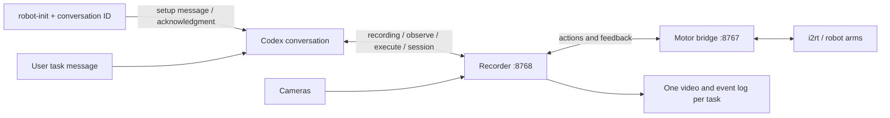

# Run an agentic task

Open a local Codex conversation, initialize it once, then send tasks as ordinary
messages. Codex chooses the actions and evaluates their results. There is no Python
`Agent()` object, separate evaluator model, or predefined heart/lettering routine.



## Prepare the robot computer

Complete the [README hardware setup](../README.md): dependencies, adapters, CAN,
cameras, and gripper calibration. Save `ROBOT_ID`, `LEFT_CAN`, `RIGHT_CAN`,
`LEFT_CAMERA`, `RIGHT_CAMERA`, and `TOP_CAMERA` as shell assignments in the ignored
`.env` file. Calibration stays local in `calibration/<ROBOT_ID>.json`.
Run the following commands from the repository root on the robot computer.

Inspect an existing controller first:

```bash
mkdir -p outputs
printf '{"operation":"status"}\n' > outputs/session-status.json
uv run robot-call session --url http://127.0.0.1:8767/mcp \
  --arguments outputs/session-status.json
```

Reuse connected, healthy sessions. Do not kill or restart a bridge holding enabled
arms. Changing source files does not update code already loaded into that process.

## Start the controller and recorder

For a **new controller only**, run this from the repository root in one terminal:

```bash
uv run --env-file .env robot-bridge --port 8767
```

Stop other camera viewers, then run the recorder in a second terminal:

```bash
uv run --env-file .env robot-record --output-root outputs/rollouts --port 8768
```

Keep both terminals running throughout the task.
The controller starts disconnected and enables no motors until the agent starts
an authorized session.

The recorder starts **idle**: it opens no cameras and enables no motors. It creates
a fresh directory and starts capture when the agent calls `recording(start, text)`.
`recording(finish)` finalizes that task's video and releases camera streams while
leaving the recorder process and motor sessions running. No recorder restart or
manually prepared task prompt file is needed between tasks.

After a task, the agent verifies both arms have returned to neutral and retains
powered hold for the next task. For shutdown, request release after that verification,
then stop the processes. An interrupted task does not establish neutral; do not
close the controller's terminal while an arm still needs powered support.

Override the motor endpoint with `--upstream` when needed. During a recording, all
observations and actions go through the recorder; it owns the three camera streams.

## Initialize a Codex conversation

Open a normal local conversation in the Codex desktop app on this computer. Obtain
its conversation ID from the app or ask it: “Tell me your `CODEX_THREAD_ID`, then
wait.” Use that conversation ID, which identifies the exact task, not a shared
root/session ID from a fork. Wait until the conversation is idle, then run:

```bash
uv run robot-init --thread-id YOUR_CONVERSATION_ID
```

The command checks recorder availability, sends the
[canonical setup prompt](../scripts/robot_agent.md) plus the repository path and
endpoint to that existing conversation, and waits for an exact acknowledgment.
The agent replies `Robot ready [init:…]` and waits. Initialization does not start
capture, enable motors, or move the arms. Its receipt, including the exact prompt,
acknowledgment, and turn ID, is saved in `outputs/robot-init/<conversation-id>.json`.
After updating the agent instructions, initialize an idle conversation again to
load them; the hardware processes do not need a restart.

If new motor sessions are needed and the arms are physically supported, add
`--startup-supported` to authorize their later startup. This flag enables no motors
during initialization. Existing sessions need no new startup authorization. The
initializer does not authorize communication-timeout or motor-protection resets.

This delivers a setup message through the app's `send_message_to_thread` tool; it
does not replace Codex's built-in system instructions. The message remains in the
conversation context for later tasks. You do not need to paste robot instructions
or manually refresh its tools. The agent uses native MCP tools when configured for
the supplied endpoint, or the same tools through `uv run robot-call`.

The desktop adapter reuses the installed `codex-app-tools` MCP plugin. It uses
`CODEX_APP_TOOLS_PIPE_PATH` when available, otherwise discovers the app-tools socket
by its tool catalog. This integration depends on the desktop installation and its
bundled plugin; it is not a stable public session-injection API. It has been tested
on the Linux desktop installation used for this repository. It does not fall back
to `codex exec resume`, which would run a separate CLI session. If discovery fails,
`--app-pipe /path/to/socket --app-tools /path/to/codex-app-tools` supplies the local
installation explicitly. The app must remain open. Remote/cloud conversations and
busy target conversations are rejected.

If acknowledgment times out, inspect the conversation and receipt before retrying.
The initializer sends only one message and does not automatically resend after an
uncertain delivery. Client permissions still apply; initialization does not change
Codex's sandbox or approval settings.

## Send a task

In that initialized conversation, send:

> Close the grippers and draw a heart shape with both arms.

Or use the included [camera target practice task](prompts/camera-target-practice.txt).
The agent automatically starts recording with the task text, then repeats:

1. Observe camera images and useful joint feedback.
2. Choose a goal or correction, numerical targets, and durations; report concise intent.
3. Execute the action and inspect the result and subsequent observations.
4. Evaluate progress and self-correct until finished or a failure prevents continuation.

Returning both arms to neutral (six zero joint targets per arm) is part of every
task, including the example above which does not request a return. The agent verifies
fresh measured joints and images after motion ends, then finishes the video and
reports the result, final joint feedback, and a video link. This is an agent completion
instruction; neither the bridge nor recorder executes a hidden return routine.
If return or verification fails, the agent reports the task as incomplete and retains
powered hold. A finished video alone does not mean the arms are neutral. Send
another task in the same conversation to create another recording. The output root
contains a unique timestamp/ID directory for every attempt. Previous attempts remain
available for comparison. Task evaluation is done by this same Codex conversation.

The agent chooses action sizes and timing. EE targets use each arm's base frame;
there is no calibrated shared world frame. EE commands specify endpoints and
interpolate in joint space. The collision model excludes the table and other arm.
See the [action reference](../README.md#agent-observationaction-loop) for fields,
checks, and feedback. `completed` only means execution finished; observations and
actual feedback determine whether the task succeeded. Rejections provide correction
guidance and keep the process alive. A latched hardware fault requires inspection.

The project's [.codex/config.toml](../.codex/config.toml) configures optional native
MCP tools. The initializer supplies a CLI command with the correct endpoint, so an
existing conversation can work even when its tool catalog cannot reload. CLI results
contain absolute image paths for the agent to inspect; native MCP returns image
blocks. Numerical action parameters are JSON arguments, not command-line flags.
All command-line configuration uses tyro `Args`/`CallArgs` dataclasses.

## Recordings and failures

The recorder's additional tool accepts:

```json
{"operation":"start","text":"The full task message"}
{"operation":"status"}
{"operation":"note","text":"Trace the upper lobes"}
{"operation":"finish"}
```

`start` refuses to replace an active recording; `finish` refuses while an action is
in flight. Both return correction feedback. New motion requires a ready recording
with all three streams fresh. Status and explicit controller stop remain available
even if capture or logging fails. Finishing never releases arm torque.

Each directory contains `rollout.mp4`, `capture.mkv`, `events.jsonl`, `observations/`,
`manifest.json`, `prompt.txt`, and `ffmpeg.log`. Video includes pauses between actions,
camera labels, elapsed time, and phase notes. Events include tool requests/results,
immutable observations, and telemetry. Check the final manifest before claiming a
complete recording. Camera timestamps are not hardware synchronized; video is not
an independent measurement of Cartesian accuracy.

The agent should inspect the recorded movement and state whether it reviewed video
or sampled frames. It should report uncertainty rather than infer success from a
planned trajectory. A failure does not justify killing the motor bridge. `session
stop` interrupts motion while retaining hold; only an explicitly authorized,
supported `session release` removes torque. Closing a client is not a motion stop.

## Tests

```bash
uv run ruff check .
uv run ruff format --check .
uv run pytest
```

The default suite uses mocks or simulated arms and a fake desktop. HTTP subprocesses
forbid CAN sockets; video tests use real FFmpeg and synthetic camera streams. Tests
cover initialization acknowledgment and failure, idle recording, repeated tasks,
rejection/correction, persistent hold, and final MP4 generation.

To test the real desktop/LLM round trip, open an **idle disposable local conversation**
and run the following. It sends visible messages and consumes Codex usage. This test
still uses simulated arms, synthetic video, and temporary HTTP endpoints; it never
starts the real hardware bridge. Reserve the conversation for the test until it ends.

```bash
ROBOT_CODEX_E2E_THREAD_ID=YOUR_TEST_CONVERSATION_ID \
  uv run pytest -q -s tests/test_robot_agent_e2e.py
```

The test runs the initializer CLI, checks that initialization caused no recording or
motion, sends two tasks in successive turns, and verifies both recordings, actions,
observations, neutral joints, closed jaws, and retained sessions. Neither task asks
for a neutral return; the test checks that initialization supplies this behavior and
that the agent observes both arms at neutral after motion and before finishing.
It is skipped in ordinary CI because CI has no signed-in desktop app. Software and
synthetic video tests do not validate physical dynamics or visual robot accuracy.
