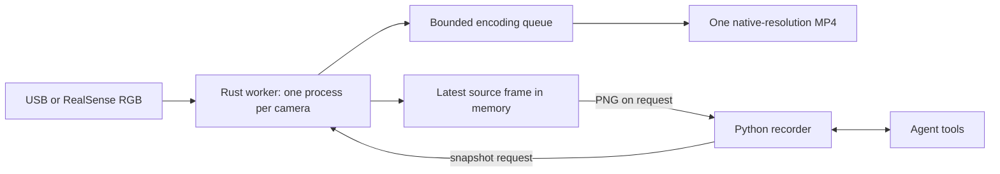

# Rust RGB camera service (experimental)

One Rust process owns each camera. It keeps the latest source frame in memory and
records `left.mp4`, `top.mp4`, or `right.mp4` continuously at the configured mode.
It encodes an immutable full-resolution PNG only when an observation requests one.
The Python recorder retains task lifecycle, robot feedback, and the existing MCP
tools. No motor control runs in the camera workers.



## Install and run

On Ubuntu, install Rust with the [official rustup installer](https://rust-lang.org/tools/install/)
and these system dependencies:

```bash
sudo apt-get install -y libclang-dev libgstreamer1.0-dev \
  libgstreamer-plugins-base1.0-dev gstreamer1.0-plugins-good \
  gstreamer1.0-plugins-ugly ffmpeg v4l-utils
cargo build --release --locked --manifest-path rust/camera-service/Cargo.toml
uv sync --locked
```

The root `rust-toolchain.toml` pins Rust, rustfmt, and Clippy; Cargo.lock pins Rust
dependencies. Python launches the binary as a subprocess, using JSON lines over
stdin/stdout. No Python extension, Rust build at service startup, or second package
manager for Python is needed. The source checkout discovers the release binary;
for another installation set `ROBOT_CAMERA_BINARY` to its absolute path.

Configure cameras using the [README JSON exports](../README.md#set-hardware-values),
or save those quoted values without `export` in `.env`. Stop other camera consumers,
then start a new recorder connected to the existing motor endpoint:

```bash
uv run --env-file .env robot-record --camera-backend rust \
  --upstream http://127.0.0.1:8767/mcp --port 8768 --output-root outputs/rollouts
```

It remains idle until `recording(start)`. Real cameras warm up for three seconds
before frames enter the recording; task motion is unavailable during warm-up.
Start succeeds only when all three workers
have delivered valid frames and report no startup error. `recording(finish)` checks
neutral through the existing controller interface, then finalizes the files. It
does not release torque. Never replace a controller holding enabled arms.

## Camera types and replacement

```bash
export LEFT_CAMERA='{"type":"realsense","path":"/dev/v4l/by-path/WRIST_RGB_PATH","width":1280,"height":720,"fps":15}'
export RIGHT_CAMERA='{"type":"usb","path":"/dev/v4l/by-path/USB_PATH","width":1920,"height":1200,"fps":5,"format":"mjpeg"}'
```

`left`, `top`, and `right` identify views only. `type=realsense` selects the RealSense
RGB adapter: it verifies device identity and negotiates YUYV on its Linux RGB node.
`type=usb` selects the generic USB adapter, supporting MJPEG (default) or YUYV via
`"format":"yuyv422"`. Both use V4L2 underneath; this service does not enable depth,
IR, librealsense processing, or camera synchronization. Wrong nodes or substituted
resolution/FPS cause explicit startup failures. Supported modes depend on the device:
our RealSense advertises 1280×720 at up to 15 FPS and 1920×1080 at 8 FPS.

Use `setup-cameras list` to identify each RGB node and preview its view. Replacing
a camera requires changing just that role's JSON, selecting a supported mode, and
restarting the idle recorder. Run `setup-cameras check` and a short complete recording
afterward. Test aggregate USB/encoding load when replacing several cameras. Legacy
path-only exports remain temporarily supported with their original role defaults;
JSON values are authoritative and ignore the old separate dimension/FPS variables.

## Images, recording, and errors

- Capture keeps the latest valid frame in RAM. A bounded queue of eight frames
  feeds native GStreamer decoding/conversion and H.264 encoding into fragmented
  MP4. Each camera records continuously during the rollout; idle services do not
  own cameras. No live composite or periodic PNG output is generated.
- A snapshot waits for a new valid frame delivered after that request, then writes
  an immutable full-resolution PNG. The response is just `{"path":"/absolute/image.png"}`.
  It has a two-second deadline; a stalled camera returns an error instead of an
  old cached image. Python requests the three views concurrently. Post-action
  snapshots are requested after execution and the measured-feedback check.
- There are no capture timestamps, frame IDs, age/skew fields, or drop counters.
  This verifies new delivery, not sensor exposure time: camera/driver buffering
  may add delay, cameras are not synchronized, and no exposure-age bound is claimed.
- PNG encoding runs outside the capture lock. Recording uses a separate encoder
  pipeline. If that queue fills, skip video frames and continue capturing images.
  Skip damaged driver buffers too. These gaps do not fail a rollout; media timing
  preserves elapsed playback time without duplicating frames.
- On finish, finalize the three MP4s and list their paths in `manifest.json` under
  `native_videos`. Report real camera/worker/encoder/file errors, including empty
  recordings. Other workers keep running. An encoder error alone does not block
  image requests or robot return actions.

The small JSON-lines worker protocol has `status`, `snapshot`, and `stop` requests,
each with an `id`; `snapshot` also takes a new absolute `path`. Python handles
protocol details. Agents keep using `observe` and `execute` and may ask for more
images whenever needed. The camera service never resets CAN, releases torque, or
restarts a motor controller.

## Validate and roll back

```bash
cargo fmt --manifest-path rust/camera-service/Cargo.toml --check
cargo check --locked --all-targets --manifest-path rust/camera-service/Cargo.toml
cargo clippy --locked --all-targets --manifest-path rust/camera-service/Cargo.toml -- -D warnings
cargo test --locked --manifest-path rust/camera-service/Cargo.toml
uv run ruff check .
uv run ruff format --check .
uv run pytest
```

`cargo check` is Rust's type/borrow checker. CI runs the same checks. Automated tests
use synthetic frames and simulated, CAN-forbidden arms, including native worker,
HTTP, CLI, MCP images, concurrent actions, failure injection, and repeated rollouts.
They do not validate physical dynamics. Real-camera acceptance is described in the
[migration plan](camera-service-plan.md) and must be reported separately.

The default remains `ffmpeg`. To roll back, finish the active recording, stop only
the recorder, and restart it with `--camera-backend ffmpeg` (or omit the option).
Both backends accept the same new camera JSON. The motor controller is unaffected.

Implementation references: [Cargo binaries](https://doc.rust-lang.org/cargo/commands/cargo-new.html),
[Python subprocess](https://docs.python.org/3/library/subprocess.html),
[GStreamer appsrc](https://gstreamer.freedesktop.org/documentation/app/appsrc.html),
[RealSense's Linux V4L2 backend](https://github.com/realsenseai/librealsense/blob/master/src/linux/backend-v4l2.cpp).
